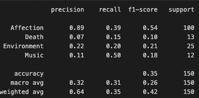

# NLP_PoemClassifier
Classifying the Genre of Poems using NLP

 ## Dataset

This data can be found here: https://www.kaggle.com/datasets/ramjasmaurya/poem-classification-nlp/data
It contains poems with the target feature genre being either Affection,Environment,Music or Death.

## Data Preparation for Poem Genre Classification
The dataset comprises a collection of poems, with the aim of classifying each poem into one of four genres: **Affection**, **Death**, **Environment**, and **Music**. The data preparation process is a crucial step to ensure the quality and effectiveness of the machine learning model. Here’s how the data was prepared for the classification task:

### Text Cleaning
Each poem underwent a series of preprocessing steps to remove noise and reduce complexity:
- **Stopwords Removal**
- **Special Characters Removal**
- **Case Normalization**
- **Stemming**

### Feature Extraction
- **TF-IDF Vectorization**:Converted the cleaned text data into a numerical format suitable for machine learning

### Training and Testing Split
The dataset was randomly split into a training set and a testing set, following the standard practice to assess the model's performance on unseen data
- **70% Training Data**
- **30% Testing Data**

### Model Selection
I evaluated a Linear Regression, Random Forest Classifier, and an SVM model to compare metrics. In the end the RandomForestClassifier performed the best:

### Still work to do like training a CNN or using BERT
